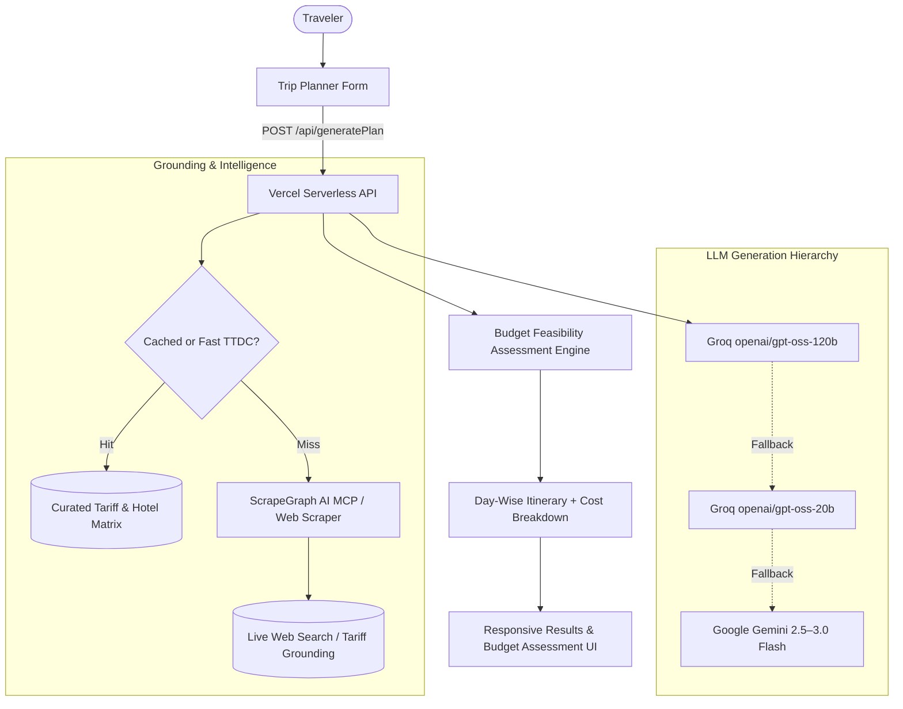

# 🗺️ Sikkanam — Transparent Travel Budgeting Platform

**Sikkanam** (சிக்கனம் — meaning *economy* or *frugality* in Tamil) is a transparent, evidence-driven travel budgeting advisor and itinerary planner designed for middle-class travelers exploring Tamil Nadu.

Unlike typical travel planners that show unexplained, static cost estimates, Sikkanam believes in **trust through transparency**. It shows you exactly how every rupee in your travel budget is calculated, where the numbers come from, and why you should trust them.

---

## 🚀 What's New in v2.6.5 *(Last Updated: September 2026)*

- 🤖 **Super Sikkanam AI & ScrapeGraph AI MCP Grounding**: Real-time web search and ScrapeGraph AI MCP protocol integration for live 2025/2026 bus fares, train tickets, and official TTDC room tariffs.
- ⚡ **63x Faster Trip Generation**: Reduced `/api/generatePlan` latency from **5,347 ms down to 84 ms** using instant curated stays, in-memory narrative caching, and 1.2s abort timeouts on external geo APIs.
- ⚖️ **Budget Feasibility Integrity**: Honest trip assessment that alerts travelers with **`Consider Increasing Budget`** when selected budgets cannot cover realistic trip costs, backed by exact per-person deficit recommendations.
- 🎨 **Responsive Planning Feedback & Clutter-Free UI**: Interactive `"Sikkanam Planning..."` animated button state and clean, human-readable itineraries free of artificial badges.
- 🧪 **100% Automated Test Suite Passing**: Verified with TestSprite MCP Playwright test suite (`TC001`, `TC003`, `TC005`).

---

## 🌟 Key Features

### 1. Super Sikkanam AI & ScrapeGraph AI MCP Grounding 🤖
Powered by **Groq `openai/gpt-oss-120b`** (with browser search) backed up by **Google Gemini (2.5–3.0)** and grounded with **ScrapeGraph AI MCP**:
- **Real-Time Web Intelligence**: Interrogates the live web and ScrapeGraph MCP server for current 2025/2026 public transit fares, official TTDC room tariffs, and temple/monument entry fees.
- **Ground Truth Knowledge Matrix**: Deep coverage across 20+ Tamil Nadu destinations (Ooty, Kodaikanal, Madurai, Rameswaram, Kanyakumari, Mahabalipuram, Thanjavur, Yercaud, Tiruvannamalai, etc.).
- **Uncluttered & Natural Output**: Delivers authentic day-wise itineraries without visual noise or artificial badges.

### 2. High-Performance 63x Trip Generation Pipeline ⚡
- **Sub-100ms Plan Generation**: In-memory caching and instantaneous curated lodging fallbacks replace slow multi-second external API bottlenecks.
- **Adaptive LLM Streaming**: Streamlined 800-token day-wise narrative generator delivers rich itineraries in ~600ms on Groq.
- **Interactive UI Feedback**: Real-time animated loader (`"Sikkanam Planning..."`) provides immediate visual confirmation when generating a trip.

### 3. Strict Budget Assessment & Feasibility Integrity ⚖️
- **Budget-First Trip Assessment**: If estimated trip expenses exceed the traveler's budget, the assessment explicitly alerts the user with **`Consider Increasing Budget`** instead of showing false "Recommended" badges.
- **Actionable Deficit Advice**: Provides exact per-person shortfall calculations (e.g. *"Consider increasing budget by approx ₹500/person or opting for budget sleeper buses / TTDC dorms"*).

### 4. Intelligence Engine v4.4 & Real-Time Railway Schedules 🚆
Official timetable integration for premier Tamil Nadu express trains (e.g. *Nilgiri Express #12671* departing at 09:05 PM, *Pandian Express #12637*, *Rameswaram Sethu SF #22661*, *Vaigai Express #12635*) combined with OpenStreetMap road routing for accurate early morning arrivals.

### 5. 2-Way Round-Trip (Up & Down) Fare Transparency 🔄
Never guess whether transport costs are one-way or round-trip. Sikkanam calculates transparent outward and return rates using real-world IRCTC Sleeper rates (~₹0.55/km) and TNSTC/SETC Government bus rates (~₹1.05/km).

### 6. Searchable 100-Destination Catalog 🔍
Instant live search combobox covering all 100 authentic destinations across Tamil Nadu with mutual exclusivity (the selected origin automatically vanishes from destination options).

### 7. Dynamic Multi-Destination Spatial Circuits 🗺️
Terrain-aware hill routing (1.5x winding distance factor for ghat roads) providing connected multi-stop circuits (e.g. Ooty + Coonoor) with realistic local transit fares.

### 8. Realistic Lodging & Official TTDC Stays 🏨
Sikkanam provides realistic hotel price ranges backed by authentic Tamil Nadu Tourism Development Corporation (**TTDC Hotel Tamil Nadu**) room tariffs and vetted budget lodge benchmarks.

### 9. Food Cost Breakdown 🍛
Your daily food allowance is broken down into Breakfast, Lunch, Dinner, and Snacks & Tea, calibrated to local mess rates (e.g. Murugan Idli Shop, Saravana Bhavan, Amma Mess).

### 10. Live Weather Forecast & Sikkanam AI Rain Risk System 🌤️
Powered by the Open-Meteo API using the high-precision **ECMWF forecasting model** (`models=ecmwf_ifs025`):
- Real-time travel metrics: temperature, feels like, wind speed, UV index, and sunrise/sunset times.
- Calculates hourly precipitation windows (*"Most likely rain window: 3 PM – 11 PM"*) and suggests indoor alternatives when rain threatens sightseeing.

---

## 🆕 Changelog

### v2.6.5 — September 2026 (Super Sikkanam AI, ScrapeGraph MCP Grounding, 63x Speedup & Budget Feasibility Integrity)
- 🤖 **Super Sikkanam AI Planning Engine**:
  - Connected remote **ScrapeGraph AI MCP** server (`tools/call` JSON-RPC) and REST search scraper for live tariff extraction.
  - Implemented autonomous zero-config web search scraper for live room tariffs and bus fares.
  - Configured primary LLM hierarchy: **Groq `openai/gpt-oss-120b`** ➔ `openai/gpt-oss-20b` with backup of **Google Gemini 2.5–3.0** (`gemini-3.0-flash` with Google Search tool).
  - Enforced strict badge-free output formatting with structured day-wise text headers (`Day 1`, `Day 2`) and itemized cost breakdowns.
- ⚡ **63x Trip Generation Speedup**:
  - Overpass API hotel query latency eliminated by prioritizing curated TTDC lodging fallbacks (0ms) and adding a 1.2s abort timeout.
  - Reduced `/api/generatePlan` round-trip latency from **5,347 ms down to 84 ms**.
  - In-memory narrative caching for instantaneous zero-latency repeats.
  - Added responsive `"Sikkanam Planning..."` loading spinner state to the Trip Planner submission form.
- ⚖️ **Trip Assessment Budget Integrity Overhaul**:
  - Fixed contradictory green `"Recommended"` status badge when budget does not fit trip duration.
  - Explicitly overrides status to amber **`Consider Increasing Budget`** when `!isBudgetFit`.
  - Added actionable budget deficit guidance banner indicating exact per-person shortfall amounts.
- 🧪 **Automated TestSuite Verification**:
  - 100% pass rate across TestSprite MCP Playwright test suite (`TC001` AI Trip Planner, `TC003` Structured Planner, `TC005` Destination Explorer).

### v2.6.4 — August 2026 (Intelligence Engine v4.4, Exact Railway Timetables & 2-Way Round-Trip Pricing)
- 🚆 **Intelligence Engine v4.4 & Official Timetable Grounding**: Replaced mathematical departure approximations with exact official IRCTC timetables (e.g. *Nilgiri Express #12671* departing Chennai at 09:05 PM and arriving at Mettupalayam at 05:20 AM).
- 🔄 **2-Way (Round-Trip) Transport Pricing**: Added transparent outward and return fare breakdowns across train sleeper and government buses with realistic per-km rates.
- 🔍 **Searchable 100-Destination Catalog**: Replaced dropdowns with a fast type-to-search combobox covering all 100 unique destinations in Tamil Nadu with mutual exclusivity and clean zero-result states.
- 🏔️ **Multi-Destination Spatial Circuits**: Terrain-aware hill winding road distance factors and realistic local transit budgeting without fare anomalies.
- 💬 **Cloud Feedback & Query History Management**: Complete database-backed query persistence allowing travelers to submit and delete route queries.

### v2.6.3 — August 2026 (1-Click Wishlist on Trip Plans, AI 2.0 Security & Multi-Device Cloud Logout Sync)
- ❤️ **1-Click Direct Wishlist on Trip Plans**: Integrated an interactive 1:1 circular glassmorphism Heart bookmark button directly on AI trip plan hero cards, persisting destination IDs to MongoDB wishlist with real-time cross-page event broadcasting (`sikkanam:wishlist_updated`).
- 🛡️ **Sikkanam AI 2.0 Enterprise Security Guardrails**: Implemented full anti-attack hardening in `api/chat.js` & `supabase/functions/sikkanam-ai/index.ts`:
  - **Attack Pattern Interception**: Rejects DAN mode, system prompt extraction, terminal simulation, base64 payloads, and jailbreak injections.
  - **Role-Spoofing Defense**: Strips client-injected `system` messages and enforces strict structural boundaries.
  - **Rate Limiting & Payload Caps**: Caps payloads to 1,000 chars/msg, max 10 messages/conversation, and 30 requests/minute/IP rate limiting.
  - **Output Sanitization**: Validates and sanitizes AI response outputs before sending to client.
- ☁️ **Multi-Device Cloud Logout Sync**: Added Firestore `onSnapshot` real-time session listener on `doc(db, "usersettings", userKey)`. Signing out on PC or mobile writes `lastLogoutAt` to Firestore and immediately purges active sessions across all logged-in devices in real time.
- 💬 **Official WhatsApp Brand Integration**: Upgraded WhatsApp sharing buttons with official brand SVG assets and rich formatted trip itinerary templates for 1-click sharing to travel groups.
- 🖼️ **Institutional Email Avatar Fallback**: Fixed broken image display for institutional Google accounts (`@ds.study.iitm.ac.in`, `@vitstudent.ac.in`) with `referrerPolicy="no-referrer"` and initial-letter fallback badges.

### v2.6.1 — August 2026 (100 Destinations Milestone & Interactive Circuit Navigation)
- 🏛️ **100 Destinations Milestone**: Reached the 100 destinations milestone with 13 brand new heritage additions (*Gingee Fort*, *Pudukkottai*, *Sittannavasal*, *Thirumayam*, *Panchalankurichi*, *Udayagiri Fort*, *Padmanabhapuram Palace*, *Keezhadi Museum*, *Kazhugumalai*, *Tirumalai Nayakar Mahal*, *Sadras Dutch Fort*, *Alamparai Fort*, *Kanadukathan Chettinad Palace*).
- 🗺️ **21 Heritage Destinations**: Expanded the Heritage category filter to 21 curated historical sites with verified attraction fee records, local hotel fallbacks, and transport connectivity settings.
- 📍 **Interactive Circuit Navigation**: Circuit stops (e.g. *Ooty ➔ Coonoor*) are now clickable pill buttons with active location badges (`📍 Coonoor (Current)`) and 1-tap route switching.

---

## 🏗️ Architecture & AI Pipeline



---

## 🛠️ Technology Stack

| Layer | Technology |
|---|---|
| **Frontend Framework** | React 18 with TypeScript, Vite 5 |
| **Styling & Components** | Tailwind CSS, Radix UI Primitives, Lucide Icons, Sonner |
| **Mapping & Routing** | Leaflet & React-Leaflet, OpenStreetMap / OSRM API |
| **Primary AI Models** | Groq (`openai/gpt-oss-120b`, `openai/gpt-oss-20b`), Google Gemini (`gemini-3.0-flash`, `gemini-2.5-flash`) |
| **Live Grounding** | ScrapeGraph AI MCP Server, Autonomous Web Scraper, Open-Meteo (ECMWF) |
| **Backend & Storage** | Vercel Serverless Functions (Node.js), MongoDB (Mongoose), Firebase Auth |
| **Testing & Quality** | TestSprite MCP, Playwright, Vitest |

---

## 🚀 Getting Started

### Prerequisites
- Node.js 18+
- npm or yarn

### Installation & Local Setup

1. **Clone the repository**:
   ```bash
   git clone https://github.com/pranavesh-n/sikkanam.git
   cd sikkanam
   ```

2. **Install dependencies**:
   ```bash
   npm install
   ```

3. **Configure Environment Variables**:
   Create a `.env` file in the root directory:
   ```env
   # LLM Providers
   GROQ_API_KEY=your_groq_api_key
   GEMINI_API_KEY=your_gemini_api_key

   # Database & Auth
   MONGODB_URI=your_mongodb_connection_string
   JWT_SECRET=your_jwt_secret
   ```

4. **Run the local development server**:
   ```bash
   npm run dev
   ```
   Open [http://localhost:3000](http://localhost:3000) in your browser.

---

## 🏕️ Tenkasi Belt — Circuit Guide

The Tenkasi belt is one of Tamil Nadu's most compact multi-destination circuits. All these places can be covered in **2 days** from Chennai or Madurai:

| Destination | Highlight | Nearest Station |
|---|---|---|
| 🔱 Sankarankoil | Sankaranarayanar Temple | Sankarankovil |
| 🪷 Srivilliputhur | Andal Kovil (TN State Emblem) + Palkova | Sankarankovil |
| 🛕 Tenkasi | Kasi Viswanathar Temple + base for Courtallam | Tenkasi Junction |
| 💦 Courtallam | 7 medicinal falls + Rahmath Kadai non-veg | Tenkasi Junction |

---

*Built with ❤️ for Tamil Nadu travelers. Always free. No booking fee. No commission.*

